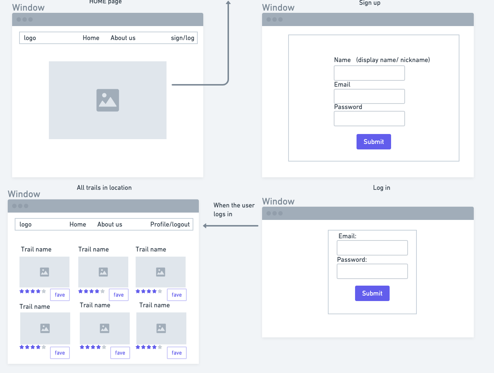

# Trail Blazer
Trail Blazer is a project that utilizes MongoDB, React components, and the 3rd party API Hiking Project, (https://www.hikingproject.com/data). Sensitive user data is hidden with genSalt, and verified with token.


#### User Stories
- A user can create an account with a username and password.
- A user can update their account's latitude, longitude, and distance from hikes.
- A user will be able to see a list of hikes in their area based on their details from Hiking Project API.
- A user can view details of a hike, and add that hike to their list of favorites.
- A user can view their own favorites on a rendered page.
- A user can delete their favorites, and receive an updated favorites page.
#### Planning
We planned this app by the following sprint goals:
- Day One: test API, create API renders in front end, set up master github, create mern auth, and set up user schema.
- Day Two: Identify areas of concern and research, test routes in postman, consolidate master with users' work, and plan components.
- Day Three: Finalize schema for our user profile, create Hike components including: allhikes, which renders "hikes" component for each api value. and hike component which renders hikeId component for a particular api hike component.
- Day Four: Create functions for editing a user's properties and adding trails to a user's favoriteTrails.
- Day Five: Add conditionals to user's favoriteTrails to prevent multiple trails from rendering. Add delete functions to delete a particular trail from a user's favorited trails.

#### UserSchema
We created a main User model with input of our "favorited trails" to find 
```const UserSchema = new Schema({
    name: {
        type: String,
        required: true,
    },
    email: {
        type: String,
        required: true,
    },
    password: {
        type: String,
        required: true,
    },
    displayName: {
        type: String,
        default: 'hiker001'
    },
    longitude: {
        type: Number,
        default: -122.3321
    },
    latitude: {
        type: Number,
        default: 47.6062
    },
    radiusTrail: {
        type: Number,
        default: 10
    },
    userTrails: Array,
}) 
```

#### Wireframes


#### Routes

## User
|Method | Path | Location | Purpose |
|-----------------|---------------|--------------------|-------------------|
| Post | '/register' | (backend)api/users | find a user by params, if user exists do not create new user salt and hash to utilize protected values|
| Post | '/login' | (backend)api/users | find a user in login form, compare using bcrypt |
| Get | '/current' | (backend)api/users | find the current user |
| Post | '/profile' | (backend)api/users | find a user by id, update with new values in long, lat, radius |
| Post | '/profile/get' | (backend)api/user | find a user by id, resend user's datas to update new state |
| Post | '/createtrail' | (backend)/trails | find a user by id, when found, push favorited trail into user |
| Post | '/delete' | (backend)/trails | find a user by id and update, delete a trail from a user |

#### Install Instructions
- We'd love you to try out our app. You can fork and clone both our frontend and backend repositories here: 
FrontEnd: (https://github.com/SLBendak/p3-trails-frontend)
BackEnd: (https://github.com/SLBendak/p3-trails-backend)
- You'll need to npm i to install our modules, and create a .env file with an api key from API Hiking Project here (https://www.hikingproject.com/data).
- Once you've created these connections add your mongo server url to your .env, and start your server and react app.
- Create a user and try out our hikes!

#### Links
Thank you to our wonderful API! From Hiking Project (https://www.hikingproject.com/data)
Make sure to check out our backend too! (https://github.com/SLBendak/p3-trails-backend)

#### Future Goals
In the future we'd like to implement user experience to locate the latitude and longitude of a user's input city, in order to help them find their hike locations.